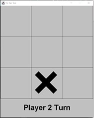

# 1.1 Tic Tac Toe Game Clone Overview

**Overview written by Peter Mitchell.**

## Contents

```
1.1 Tic Tac Toe Game Clone Overview 
1.2 Introduction 
1.3 The Rules of Tic Tac Toe
1.4 High Level Discussion About Implementation 
1.5 How the Core Game Works 
1.6 Features You Could Add
```
# 1.2 Introduction

This document will explain the fundamentals of how the Tic Tac Toe game works.

- ([Youtube Demo](https://youtu.be/uv9m0cjglIY))

# 1.3 The Rules of Tic Tac Toe

Tic Tac Toe is a simple game that has the following rules.

- Each player (2 players) will be placing either an X or an O for the duration of the game.
- The game is presented as a 3x3 grid.
- The goal is to create a line of three of your own X or Os.
- X player is the first player. They play their move; then the O player responds with their own
    move, and this continues until the game ends.
- The game ends when either a winner has been determined from three Xs or three Os in a row,
    or there are no more available places on the grid to play a move.

# 1.4 High Level Discussion About Implementation

The first step when the game is open is selecting what game mode to use. The player can choose to
play the game as Player vs Player where no AI is used. Player vs Random AI where the AI chooses
moves completely at random, or Player vs Hard AI, where it will take the current board state and try
to choose the best move. If at any time the player wishes to swap the game mode, the “A” key can be
pressed. The game can also be restarted with R or exited with Escape.


After selecting the game mode, you will see something like below. The player’s take turns. If you are
playing against the AI, it will take the AI turns instantly so the Player 2 Turn will not actually show up.
You can see the game prompts Player 1 to take a turn to place an X, then the Player 2 can select to
place an O and it returns to Player 1’s turn.

  

After reaching a winning board state the game will end as shown below with the Player 1 won, Player
2 won, or a draw. The game can then be restarted by pressing R.

  

# 1.5 How the Core Game Works

This section will summarise the classes used in this game. For full details review the code files where
you will find comments for every method, class, and variable.

Generic Classes:

- Position: Represents a pair of x and y values.
- Rectangle: Represents a rectangle of space offset by x and y and including a width and height.

Core Game:

- Game: Controls the JFrame and keyboard input.
- GridCell: Represents a single cell on the grid that can be empty, and X, or an O.
- GameGrid: Controls a collection of GridCells.
- GamePanel: Controls the game state by using the GameGrid.

AI:

- TicTacToeAI: A simple interface to allow multiple different AI behaviours to be easily used by
    the GamePanel.
- RandomAI: A terrible AI that just selects valid moves at random with no consideration for
    game state.
- MinimaxAI: A much harder AI that will try to choose moves that improve its chance at winning.
    Note though that it will in some situations not correctly block the player from winning. As
    described in the next section.

# 1.6 Features You Could Add

There are many small changes that could be made to modify the game as it currently is. The following
list summarises some of these possible changes.


- The HardAI has one serious flaw. It does not
    consider the player’s immediately next move for
    the purpose of preventing the player from winning.
    The HardAI is programmed to choose a move that
    will best improve its own next move but is flawed.
    On the right is an example of the problem with the
    AI. The numbers in the upper left corner of each cell
    show the sequence to trigger the problem. Placing
    a marker in bottom middle at 1 makes the AI choose
    2 in the top left. Then choosing 3 in the middle
    makes the AI choose 4 in the top middle. The player
    must then block with 5 in top right to prevent the AI
    going there. This then should mean that the AI
    chooses bottom left to block the X player winning.
    Instead, they place it at 6 due to a problem with the
    AI. The AI is trying to fill the column on the left and
    is not considering blocking the player as a priority.


- You could try allowing moving of cells so that choices are not locking in a constant position.
- You could try doing something like Russian dolls where you start with a collection of different
    sized pieces to place with a limited number of them. You could “capture” places by choosing
    to place a larger piece over a smaller piece of the opponent.
- You could try changing the size of the grid and look at the effect this has on the game.
- You could look at other examples of ways people have changed Tic Tac Toe and try to add
    some of those features.
- Come up with your own unique feature to add and try to implement it.


